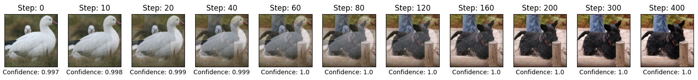
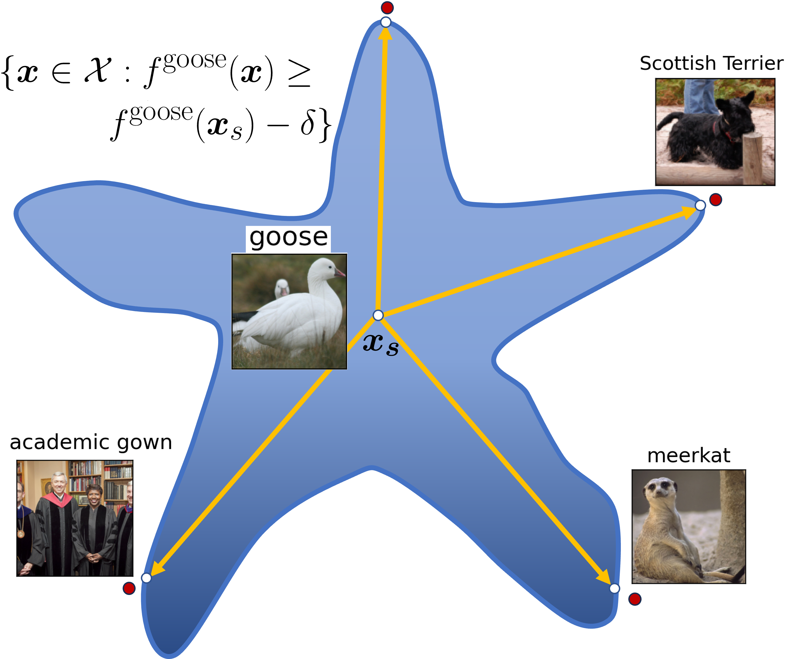
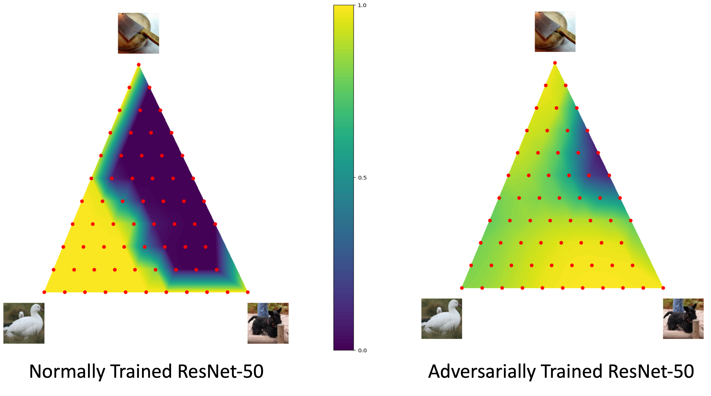

# Exploring Geometry of Blind Spots in Vision Models

This repository contains code for the implementation of our paper "Exploring Geometry of Blind Spots in Vision Models", accepted as a Spotlight at NeurIPS 2023. Our paper is available on arXiv [here](https://arxiv.org/abs/2310.19889).

-  We present a novel Level Set Traversal (LST) algorithm that iteratively uses orthogonal components of the local gradient to identify the "blind spots" of common vision models such as CNNs and ViTs on CIFAR-10 and ImageNet.
- We thereby show that there exist piecewise-linear connected paths in input space between images that a human oracle would deem to be extremely disparate, though vision models retain a near-uniform level of confidence on the same path.
- Furthermore, we show that the linear interpolant path between these images also remarkably lies within the same level set; as we observe the consistent presence of this phenomenon across arbitrary source-target image pairs, this unveils a star-like set substructure within these equi-confidence level sets.
- We demonstrate that adversarially robust models tend to be _under-sensitive_ over subsets of the input domain that lie well beyond its original threat model, and display level-sets of high-confidence  that extend over a significant fraction of the triangular convex hull of a given source image and arbitrary pair of target images.

## Level Set Traversal (LST) 
In this work, we investigate the phenomenon of under-sensitivity of classification models, wherein large-magnitude semantic perturbations leave network activations unchanged. It can be shown that under mild conditions, the level sets of differentiable functions are smooth submanifolds. We develop a novel Level Set Traversal (LST) algorithm to study and explore the geometry of level sets of common vision models, and thereby identify "blind spots" that occur within such high-confidence level sets.

Towards this, we use the key insight that the level set is orthogonal to the local input gradient of the model. In brief, given a source-target image pair, we iteratively modify the source image to traverse the level set by computing the projection of the difference vector at each iterate onto the orthogonal complement of the local gradient. For the detailed algorithm, kindly refer to Section-3 of the paper. 

Using a source image of a 'goose' and a target image of a 'Scottish terrier' (a dog), we present the intermediate images over the path traversed by the LST algorithm for a ResNet-50 model along with confidence scores with respect to the source class 'goose' beneath each image:

    

 We observe that the model predicts the 'goose' class with very high confidence for all images over the path, though the target blind spot found by LST clearly appears as a 'dog' to human oracles.

We observe this phenomenon across generic source-target image pairs of different classes. We randomly select five images from five arbitrary ImageNet classes, and compute LST blindspots for all possible source-target image pairs in the image grid below using a ResNet-50 model. If we order the five selected images, the $i^{th}$ row and $j^{th}$ column of the image-grid is the LST output obtained using the $i^{th}$ image as target and $j^{th}$ image as the source. Thus, each column represents the source image being transformed iteratively into the other target images. The confidence of the model prediction for the source class (names on top of each column) is displayed just below each image. We observe that the output LST blind spot images are almost indistinguishable from the target while retaining high model confidence for the source class. For example, all four LST blind spot images in the first column (highlighted), using the source 'goose' image, are predicted to be of the 'goose' class with very high confidence by the ResNet-50 model.

 

    

Thus, using the LST algorithm, we find that the level sets of common models extend outwards in an expansive, connected manner to include images of _arbitrary_ classes, which human oracles would never state as being similar. we also interestingly observe that the linear interpolant path from any given source image to a LST blind spot output for arbitrary target images retains high model confidence throughout. This thereby unveils a remarkable star-like connected substructure for superlevel sets as shown below, where the number of "limbs" or linear protuberances of the star-like structure is _extraordinarily large_, plausibly as large as the number of images in all other classes.

 

    

To evaluate the extent of the model invariance over the regions between the LST outputs and the source image, we additionally study two-dimensional sub-spaces by evaluating the model confidence over the triangular convex hull obtained by linear interpolation over three reference points, namely the source image and the two target blindspot images produced using LST. We visualize these in the figure below, with the orginal source 'goose' image fixed at the lower left vertex. Here, the prediction confidence (in the range $[0,1]$) assigned by the model with respect to the source class is mapped to a continuous colorbar, with high-confidence points (close to $1.0$) appearing as bright yellow, and low-confidence points (close to $0.0$) appearing as dark violet. 

 

    

The linear interpolant paths from the source image maintains high confidence, implying that it is linearly connected to the LST target outputs in a star-like substructure within the level set. Furthermore, for adversarially trained models we observe that a significant fraction of the triangular hull lies in the superlevel sets of high-confidence, thereby indicating their under-sensitivity in regions far beyond their original threat model.

## Environment Setup

1. Python 3.11
2. `pip install -r requirements.txt`

## Code organization

The primary file that needs to be run is level_set_traversal.py . There are two compulsory args: model and dataset. It can be run in two modes '--examples' or '--full_eval'.

1. '--examples': 
    This picks one image from each class in target_classes, and tries to find paths from each image to every other image using the LST algorithm
    It outputs a pkl file summarizing the results in 'plots_and_figures' directory, which can be loaded once generated with the '--load_dict' flag.
    It also saves a visualization of the final LST output images and the triangle contour plot. 
    Enabling the 'get_widths' option also gets a visualization of the path widths.

2. '--full_eval': 
    This runs the LST algo over num_samples images picked from the dataset.
    Dumps a pkl file containing a summary of the LST results with image distance metrics (Table 1 in the paper), along with a pkl file containing confidence statistics measured over the triangular convex hulls (Table 2 of the paper). The results can be printed in a tabular form using print_tables.py
    

Run Command:

`python -u level_set_traversal.py resnet50-normal imagenet --full_eval --step_size 1e-2 --iters 400 --width_distances 0.5 1 1.5 2 --log_step 20 --pthresh 0.2 --adv_pert --adv_step_size 2e-3 --batch_size 196 --get_final_imgs" `

